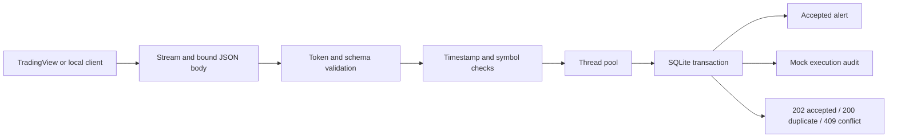

# TradingView Webhook Service

[](https://github.com/harper698/tradingview-webhook-service/actions/workflows/ci.yml)


**Turn chart alerts into validated, durable simulation records, even when the same alert arrives twice.**

[中文说明](README.zh-CN.md) · [Verification](docs/VERIFICATION.md) · [TradingView setup](docs/TRADINGVIEW.md)

This independent portfolio project demonstrates a common automation requirement: receive a trading
signal, check that it is authentic and current, and forward it to a mock execution handler without
duplicating its effect. The handler writes an audit record to SQLite. **It never places trades or
connects to a broker.**

## What it demonstrates

- **A defensive HTTP boundary:** JSON token authentication, a streaming 16 KiB body limit, exact
  schema, symbol allowlist, finite positive prices, and timestamp freshness checks.
- **Durable idempotence:** an identical event returns `200 duplicate`; the same ID with different
  content returns `409`. Concurrent requests and process restarts keep one simulation per ID.
- **Atomic dispatch:** the accepted alert and simulated action commit together. A failure in the
  mock handler rolls back both; a locked database returns a retryable `503`.
- **Safe failure reporting:** tokens are excluded from persisted payloads, responses and application
  logs; invalid input is never echoed. Blocking SQLite work runs in the thread pool.
- **Inspectable proof:** an offline demonstration, adversarial tests, executable HTTP examples,
  a Pine Script example, bilingual documentation, and CI for Python 3.11/3.12/3.13.

**Stack:** Python, FastAPI, Pydantic, SQLite, Uvicorn; pytest and HTTPX for verification.

## Quick start

```bash
git clone https://github.com/harper698/tradingview-webhook-service.git
cd tradingview-webhook-service
python -m venv .venv
```

Activate the environment:

```powershell
# Windows PowerShell
.\.venv\Scripts\Activate.ps1
```

```bash
# macOS / Linux
source .venv/bin/activate
```

If PowerShell blocks activation, run `.\.venv\Scripts\python.exe` in place of `python` and
`.\.venv\Scripts\tv-webhook.exe` in place of `tv-webhook`; no execution-policy change is needed.

Install the demo and development dependencies, then run the offline demonstration:

```bash
python -m pip install -e ".[dev]"
python examples/demo.py
```

```text
accepted     HTTP 202
duplicate    HTTP 200
conflict     HTTP 409
unauthorized HTTP 401
after restart HTTP 200
persisted    1 alert, 1 simulated action
PASS: no network calls, no live trades, no credentials printed
```

The demo creates a temporary SQLite database and a random, temporary token. Its assertions and
outcomes are reproducible; it uses the current time for timestamp validation. No external service
or TradingView account is required. For the runtime only, use `python -m pip install -r requirements.txt`;
the TestClient demo and tests require the development extras above.
For the exact verified runtime dependency versions, use
`python -m pip install -r requirements-lock.txt` instead of `requirements.txt`.

## Run the HTTP service

Generate a dedicated token and set it in the server process. There is no default credential.

```powershell
# Windows PowerShell
$env:WEBHOOK_SECRET = python -c "import secrets; print(secrets.token_urlsafe(32))"
$env:WEBHOOK_ALLOWED_SYMBOLS = 'BINANCE:BTCUSDT,NYSE:IBM'
tv-webhook
```

```bash
# macOS / Linux
export WEBHOOK_SECRET="$(python -c 'import secrets; print(secrets.token_urlsafe(32))')"
export WEBHOOK_ALLOWED_SYMBOLS='BINANCE:BTCUSDT,NYSE:IBM'
tv-webhook
```

The default address is `http://127.0.0.1:8000`. The service exposes:

| Endpoint | Purpose |
| --- | --- |
| `GET /healthz` | Database readiness and simulation mode; no credential required |
| `POST /webhook` | Authenticate, validate, deduplicate, and record one simulated action |
| `GET /docs` | Interactive API schema; supply your token only in your local environment |

In a second terminal with the **same** `WEBHOOK_SECRET` as the server, run either:

```bash
python examples/send_alert.py
```

```powershell
.\examples\send_alert.ps1
```

Both examples generate a fresh timestamp and event ID, then send the exact request twice. Expected
results are `accepted` and `duplicate`. Do not generate a different token for the client terminal.

## API contract

```json
{
  "token": "REPLACE_WITH_YOUR_SCOPED_WEBHOOK_TOKEN",
  "event_id": "ma01.BTCUSDT.buy.20261004T120000Z",
  "symbol": "BINANCE:BTCUSDT",
  "action": "buy",
  "price": 60000.25,
  "timestamp": "2026-10-04T12:00:00Z"
}
```

This is a schema illustration: replace the token and timestamp before sending. Prices must be JSON
numbers, greater than zero and at most `1e12`, with at most 24 digits and 12 decimal places. `NaN`,
infinities, numeric strings, and booleans are rejected. Event IDs use 1–128 ASCII letters, digits,
periods, underscores, colons or hyphens. Symbols use 1–64 uppercase letters, digits and `._:/-`,
starting with a letter or digit. Extra fields and duplicate JSON keys are rejected.

Timestamps must be ISO 8601 strings with an explicit timezone. The default window permits up to
300 seconds in the past and 30 seconds in the future. **Every request, including a duplicate,
must pass authentication and freshness validation.** Retry promptly using the unchanged payload.

| Status | Meaning |
| --- | --- |
| `202` | New event and its simulated action are committed |
| `200` | Identical normalized event already committed; no new action |
| `400` | Malformed JSON, duplicate keys or incomplete body |
| `401` | Missing or incorrect token |
| `409` | Existing event ID carries different content |
| `413` | Body exceeds 16 KiB, including streamed/chunked bodies |
| `415` | Unsupported media type or compressed body |
| `422` | Schema, timestamp or symbol policy violation |
| `500` | Storage operation failed; no acceptance acknowledgement |
| `503` | Storage is busy; `Retry-After: 1` on webhook lock contention |

For `503` or an ambiguous network timeout, retry the **same event ID and payload** within the
freshness window. The server does not assume TradingView will retry automatically. Event identity
is global within one database: use a unique alert/strategy prefix and a stable logical signal ID.

## Architecture



The core transaction in [`store.py`](src/tv_webhook/store.py) serializes writers before comparing
event identity. Both audit tables use `event_id` as their primary key:

```python
with closing(self.connect()) as connection, connection:
    connection.execute("BEGIN IMMEDIATE")
    previous = connection.execute(
        "SELECT payload FROM alerts WHERE event_id = ?", (alert.event_id,)
    ).fetchone()
    if previous is not None:
        if previous[0] != payload:
            raise EventConflict
        return False
    # Insert alert and simulated action inside this same transaction.
```

Prices are compared as canonical decimals; timestamps are normalized to UTC. For example, `100`
and `100.0`, or equivalent `Z` and `+08:00` timestamps, identify the same payload. Credentials do not
participate in identity and are never stored. SQLite WAL mode permits readers during writes, with
a 250 ms lock budget. There is no in-memory deduplication cache to lose on restart.

## Configuration

| Environment variable | Default | Rule |
| --- | --- | --- |
| `WEBHOOK_SECRET` | Required | Random dedicated token; 32–128 URL-safe ASCII characters |
| `WEBHOOK_DB_PATH` | `data/alerts.sqlite3` | Persistent local SQLite file |
| `WEBHOOK_MAX_AGE_SECONDS` | `300` | Integer, 1–86400 |
| `WEBHOOK_FUTURE_SKEW_SECONDS` | `30` | Integer, 0–300 |
| `WEBHOOK_ALLOWED_SYMBOLS` | Empty | Comma-separated exact symbols; empty permits schema-valid symbols |

The [`.env.example`](.env.example) file is a reference; environment files are not automatically
loaded. `tv-webhook --host 127.0.0.1 --port 8000` changes the listener explicitly. The equivalent
factory entry point is `uvicorn tv_webhook.app:create_app --factory`. Invalid configuration fails
before the application starts serving requests.

## TradingView integration and scope

Use [`docs/TRADINGVIEW.md`](docs/TRADINGVIEW.md) for the alert message template and optional Pine
example. TradingView requires an accessible endpoint; localhost is only a development address.
This repository has been tested offline and over real local HTTP. It has **not** been deployed
as a public webhook or verified through an actual TradingView alert delivery.

For a public installation, terminate HTTPS on port 443 in a reverse proxy, restrict request size
and request time, apply ingress rate limits, retain the SQLite volume, protect filesystem access,
and monitor errors. Use a dedicated scoped webhook token, never a brokerage API key, account
password, or TradingView login credential. Keep request body logging disabled in proxies and APM.

The one-action guarantee applies to **rows committed in this SQLite database**, while those rows
are retained. It does not imply exactly-once execution by an external broker. Adding real external
dispatch requires a transactional outbox, a worker, destination idempotency, reconciliation and a
separate operational design. This project deliberately has no arbitrary outbound forwarding,
order quantities, broker credentials, position management, or performance claims.

SQLite is appropriate for this small service on local storage; it is not a distributed queue.
There is no automatic retention, migration, rate limiter or production hosting in this demo.
Freshness is a bounded replay check, not a cryptographic signature. The shared token does not prove
the sender is TradingView if it is disclosed.

## Development

```bash
python -m pytest -q
python -m ruff check .
python -m ruff format --check .
python -m build
```

Tests cover Unicode credentials, secret redaction, malformed JSON, oversized and chunked bodies,
schema and clock validation, canonical identity, concurrent duplicates, process-independent
persistence, transaction rollback, database contention and readiness. See the actual results and
verification limits in [`docs/VERIFICATION.md`](docs/VERIFICATION.md).

Related portfolio project: [Market Data Pipeline](https://github.com/harper698/market-data-pipeline)
for ingestion, cleaning, quality reporting and SQLite storage.

Licensed under [MIT](LICENSE). Independent demonstration; not affiliated with TradingView.
